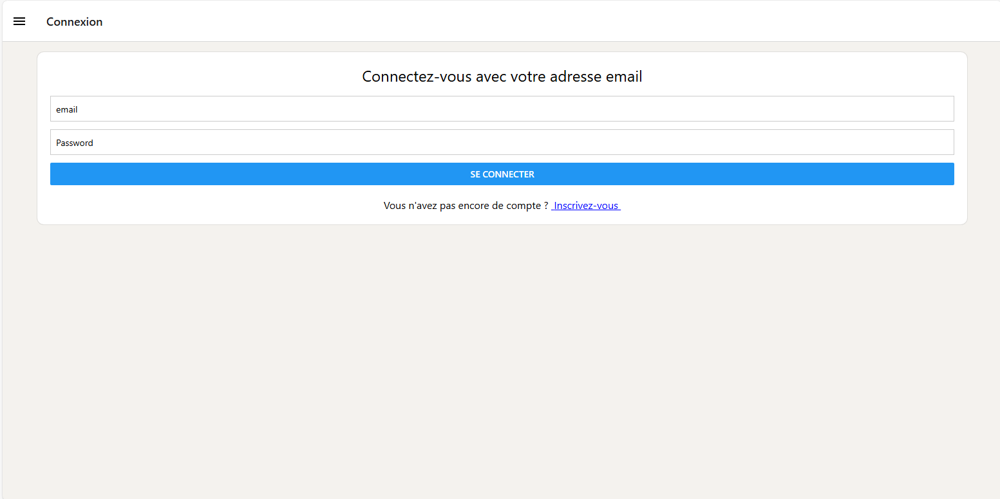

# Mobile Bank project  

## Team :
-  Frédéric Zai
-  Adam Prieto

## Context :
School project to be carried out in groups, consisting of developing the user interface of a banking application using React Native. This application will allow users to register, log in, make transfers, order cheque books and consult test information. The various functionalities need to interact with a REST API that I've previously configured.

## Technology used : 
- **Frontend**:
  - *React Native*
  - *Expo*
  - *Context API*
  - *React Navigation*
  - *Fetch*
- **Backend**:
  - *Python*
- **Database**:
  - *MySQL*

### Commands : 
- React Native install : `npm install -g react-native-cli`
- React Native for web : `npx expo install react-native-web react-dom @expo/metro-runtime`
- Expo cli install : `npm install -g expo-cli`
- Create an expo app : `expo init nomDuProjet`
- Start project : `npm start`

### Screens

#### Login Screen

#### Transfer Screen

