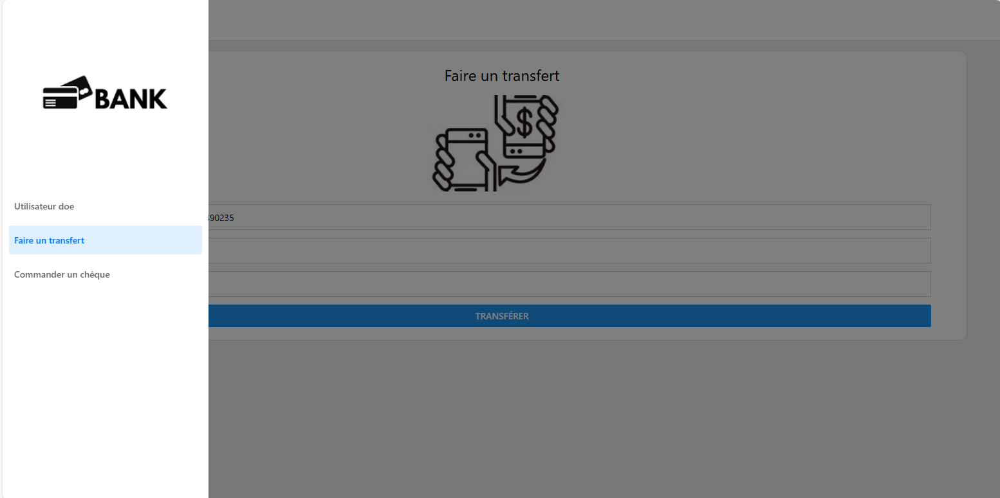

# Mobile Bank project 
## Context : 
School project to be carried out in groups, consisting of developing the user interface of a banking application using
 React Native. This application will allow users to register, log in,
 make transfers, order cheque books and consult test information.
 information. The various functionalities need to interact with a REST API that I've previously configured.
 previously configured.
## Technology used : 
- **Frontend**:
  - *React Native*
  - *Expo*
  - *Context API*
  - *React Navigation*
  - *Fetch*
- **Backend**:
  - *Python*
- **Database**:
  - *MySQL*

### Commands : 
- React Native install : npm install -g react-native-cli
- React Native for web : npx expo install react-native-web react-dom @expo/metro-runtime
- Expo cli install : npm install -g expo-cli
- create a expo app : Expo init nomDuProjet
- Start project : npm start

### Interface

#### Login Screen
